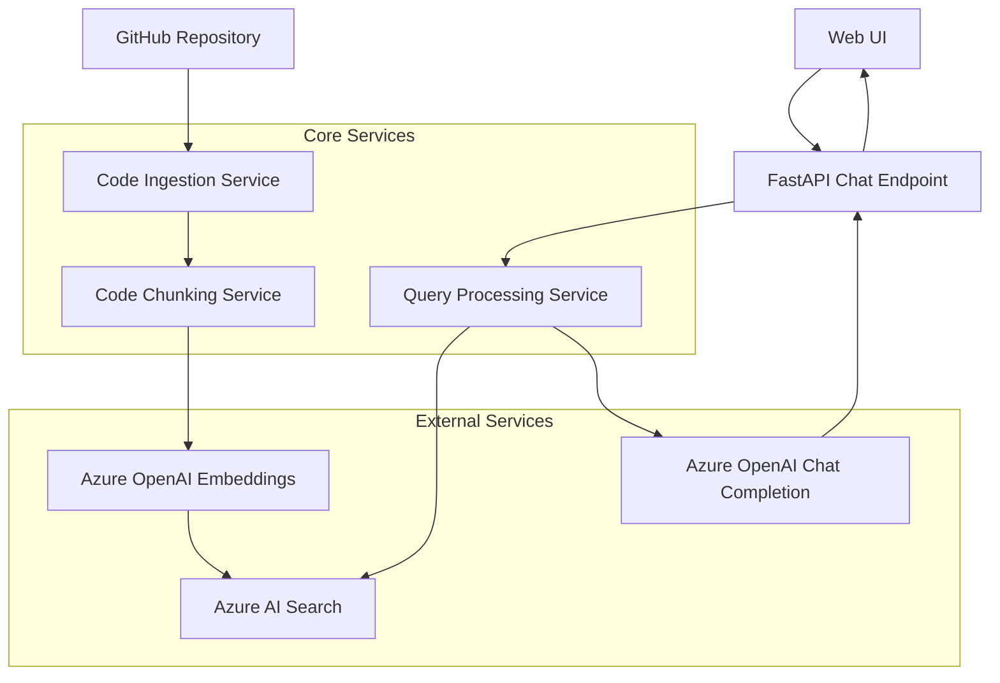

# Design Document: AI Codebase Onboarding Assistant

## Overview

The AI Codebase Onboarding Assistant is a Python-based FastAPI application that helps new developers understand company codebases through intelligent question-answering. The system ingests a GitHub repository, processes code files into semantic chunks, generates vector embeddings using Azure OpenAI, stores them in Azure AI Search, and provides a chat interface for natural language queries with grounded responses.

The architecture follows a modular design with clear separation between ingestion, processing, search, and presentation layers, enabling maintainable and testable code while focusing on MVP functionality.

## Architecture



The system uses a pipeline architecture where data flows from GitHub through processing stages to storage, while user queries flow through the chat endpoint to retrieve and synthesize responses.

## Components and Interfaces

### 1. Code Ingestion Service

**Purpose**: Fetches and validates code files from GitHub repositories

**Key Methods**:
- `ingest_repository(repo_url: str) -> IngestionResult`
- `fetch_code_files(repo_path: str) -> List[CodeFile]`
- `validate_file_type(file_path: str) -> bool`

**Supported File Types**: `.py`, `.js`, `.ts`, `.java`, `.cpp`, `.c`, `.cs`, `.go`, `.rs`, `.rb`, `.php`

**Error Handling**: Repository access failures, network timeouts, invalid URLs

### 2. Code Chunking Service

**Purpose**: Intelligently segments code files into semantic chunks respecting function and class boundaries

**Implementation Strategy**: 
Based on research findings, the service uses tree-sitter parsers to create Abstract Syntax Trees (AST) and chunk code at semantic boundaries. This approach ensures chunks contain complete functions or classes rather than arbitrary text segments.

**Key Methods**:
- `chunk_code_file(file_content: str, language: str) -> List[CodeChunk]`
- `detect_language(file_path: str) -> str`
- `preserve_boundaries(ast_node: Node) -> bool`

**Chunking Parameters**:
- Target chunk size: 512 tokens (~2000 characters)
- Minimum chunk size: 128 tokens (~500 characters)
- Maximum chunk size: 1024 tokens (~4000 characters)
- Overlap: 25% between adjacent chunks for context preservation

### 3. Embedding Service

**Purpose**: Generates vector embeddings using Azure OpenAI text-embedding-3-small model

**Key Methods**:
- `generate_embeddings(chunks: List[CodeChunk]) -> List[EmbeddedChunk]`
- `batch_embed(texts: List[str]) -> List[Vector]`

**Configuration**:
- Model: `text-embedding-3-small` (8,191 token limit, 1536 dimensions)
- Batch size: 100 chunks per API call for efficiency
- Rate limiting: Respect Azure OpenAI quotas

### 4. Search Service

**Purpose**: Manages Azure AI Search index for vector similarity search

**Key Methods**:
- `create_index() -> bool`
- `store_embeddings(embedded_chunks: List[EmbeddedChunk]) -> bool`
- `vector_search(query_embedding: Vector, top_k: int) -> List[SearchResult]`

**Index Schema**:
```json
{
  "fields": [
    {"name": "id", "type": "Edm.String", "key": true},
    {"name": "content", "type": "Edm.String", "searchable": true},
    {"name": "file_path", "type": "Edm.String", "filterable": true},
    {"name": "start_line", "type": "Edm.Int32"},
    {"name": "end_line", "type": "Edm.Int32"},
    {"name": "language", "type": "Edm.String", "filterable": true},
    {"name": "chunk_type", "type": "Edm.String", "filterable": true},
    {"name": "content_vector", "type": "Collection(Edm.Single)", "dimensions": 1536}
  ]
}
```

### 5. Query Processing Service

**Purpose**: Orchestrates query understanding, retrieval, and response generation

**Key Methods**:
- `process_query(user_question: str) -> QueryResponse`
- `retrieve_relevant_chunks(query: str, top_k: int) -> List[CodeChunk]`
- `generate_grounded_response(question: str, context: List[CodeChunk]) -> str`

**Processing Pipeline**:
1. Embed user query using same embedding model
2. Perform vector similarity search in Azure AI Search
3. Retrieve top 5-10 most relevant code chunks
4. Construct context prompt with retrieved chunks
5. Generate response using Azure OpenAI GPT-4 with grounding instructions

### 6. FastAPI Chat Endpoint

**Purpose**: Provides REST API for chat interactions

**Endpoints**:
- `POST /chat` - Process user questions
- `GET /predefined/where-to-start` - Predefined onboarding query
- `GET /health` - System health check
- `POST /ingest` - Trigger repository ingestion (admin)

**Request/Response Models**:
```python
class ChatRequest(BaseModel):
    question: str
    session_id: Optional[str] = None

class ChatResponse(BaseModel):
    answer: str
    sources: List[SourceReference]
    confidence_score: float

class SourceReference(BaseModel):
    file_path: str
    start_line: int
    end_line: int
    content_preview: str
```

### 7. Web UI

**Purpose**: Simple HTML/JavaScript interface for user interactions

**Components**:
- Chat input field with submit button
- Message history display with source references
- "Where do I start?" prominent button
- Loading states and error handling
- Clickable file references with line numbers

## Data Models

### CodeFile
```python
@dataclass
class CodeFile:
    path: str
    content: str
    language: str
    size_bytes: int
    last_modified: datetime
```

### CodeChunk
```python
@dataclass
class CodeChunk:
    id: str
    file_path: str
    content: str
    start_line: int
    end_line: int
    language: str
    chunk_type: str  # "function", "class", "module", "other"
    metadata: Dict[str, Any]
```

### EmbeddedChunk
```python
@dataclass
class EmbeddedChunk:
    chunk: CodeChunk
    embedding: List[float]
    embedding_model: str
    created_at: datetime
```

### QueryResponse
```python
@dataclass
class QueryResponse:
    answer: str
    sources: List[SourceReference]
    confidence_score: float
    processing_time_ms: int
```

## Correctness Properties

*A property is a characteristic or behavior that should hold true across all valid executions of a system—essentially, a formal statement about what the system should do. Properties serve as the bridge between human-readable specifications and machine-verifiable correctness guarantees.*

The following properties define the correctness requirements for the AI Codebase Onboarding Assistant, derived from the acceptance criteria and designed for property-based testing validation.

### Property 1: Repository Ingestion Completeness
*For any* valid GitHub repository URL, the Code_Ingestion_Service should successfully fetch all code files of supported types and return a success confirmation with the correct file count.
**Validates: Requirements 1.1, 1.2, 1.3**

### Property 2: Error Handling Consistency  
*For any* invalid repository URL or access failure condition, the Code_Ingestion_Service should return a descriptive error message that clearly indicates the failure reason.
**Validates: Requirements 1.4**

### Property 3: Single Repository Constraint
*For any* system instance, attempting to ingest multiple repositories should either reject subsequent ingestion requests or replace the previous repository while maintaining system consistency.
**Validates: Requirements 1.5**

### Property 4: Semantic Code Chunking
*For any* code file with identifiable functions or classes, the chunking process should preserve function and class boundaries, ensuring no function or class is split across chunks unless it exceeds the maximum chunk size.
**Validates: Requirements 2.1, 2.2**

### Property 5: Complete Embedding Pipeline
*For any* code chunk generated from ingestion, the system should generate a vector embedding and store it in Azure AI Search with complete metadata including file path, start line, end line, and language information.
**Validates: Requirements 2.3, 2.4, 2.5**

### Property 6: Vector Search Consistency
*For any* search query, the Search_Service should perform vector similarity search and return results ranked by relevance score, with each result containing complete file reference metadata.
**Validates: Requirements 3.1, 3.2, 3.3, 3.5**

### Property 7: Empty Search Results Handling
*For any* search query that has no relevant matches, the Search_Service should return an empty result set without errors.
**Validates: Requirements 3.4**

### Property 8: Complete Chat Processing Pipeline
*For any* user question, the Chat_Endpoint should process the query through the complete pipeline (embedding → search → retrieval → response generation) and return a structured response with grounded answers and source references.
**Validates: Requirements 4.1, 4.2, 4.3, 4.4, 4.5**

### Property 9: Task Suggestion Completeness
*For any* codebase analysis request, the AI_Assistant should provide task suggestions that include specific file references for developers to examine.
**Validates: Requirements 5.3, 5.4**

### Property 10: Predefined Query Independence
*For any* predefined query execution, the system should complete successfully without requiring additional user input and return appropriate responses.
**Validates: Requirements 5.5**

### Property 11: UI Response Display Completeness
*For any* chat response displayed in the Web_UI, both the answer text and file references should be clearly visible and the file references should be interactive (clickable or copyable).
**Validates: Requirements 6.2, 6.3**

### Property 12: UI Loading State Management
*For any* query processing period, the Web_UI should display appropriate loading states until the response is received and displayed.
**Validates: Requirements 6.5**

### Property 13: End-to-End Data Consistency
*For any* code content ingested into the system, that content should be retrievable and referenceable in chat responses, maintaining data integrity throughout the pipeline.
**Validates: Requirements 7.3**

### Property 14: System-Wide Error Messaging
*For any* error condition occurring in any system component, users should receive meaningful error messages that help them understand and potentially resolve the issue.
**Validates: Requirements 7.4**

## Error Handling

The system implements comprehensive error handling across all components:

### Repository Ingestion Errors
- **Network failures**: Retry with exponential backoff, timeout after 30 seconds
- **Authentication failures**: Clear error messages about access permissions
- **Invalid URLs**: Validation and descriptive error responses
- **Large repositories**: Progress tracking and memory management

### Processing Errors
- **Unsupported file types**: Skip with warning, continue processing
- **Chunking failures**: Fallback to simple text splitting
- **Embedding API failures**: Retry with backoff, queue for later processing
- **Search index errors**: Graceful degradation with error logging

### Runtime Errors
- **Azure service outages**: Circuit breaker pattern with fallback responses
- **Rate limiting**: Automatic throttling and queue management
- **Memory constraints**: Streaming processing for large files
- **Concurrent access**: Thread-safe operations with proper locking

### User-Facing Errors
- **Query processing failures**: Friendly error messages with suggested actions
- **No results found**: Helpful suggestions for query refinement
- **System unavailable**: Clear status messages with retry guidance

## Testing Strategy

The system employs a dual testing approach combining unit tests for specific scenarios and property-based tests for comprehensive validation:

### Unit Testing Focus
- **Specific examples**: Test known good inputs and expected outputs
- **Edge cases**: Empty repositories, single-file repositories, very large files
- **Integration points**: API endpoint contracts, service boundaries
- **Error conditions**: Specific failure scenarios and recovery paths

### Property-Based Testing Configuration
- **Framework**: Hypothesis for Python property-based testing
- **Iterations**: Minimum 100 iterations per property test
- **Test tagging**: Each property test tagged with format: **Feature: ai-codebase-onboarding, Property {number}: {property_text}**
- **Data generators**: Smart generators for code files, repository structures, and user queries
- **Shrinking**: Automatic test case minimization for failed properties

### Test Data Generation
- **Code repositories**: Generate valid repository structures with various languages
- **Code files**: Create syntactically valid code with functions, classes, and edge cases
- **User queries**: Generate realistic developer questions and edge case queries
- **Error conditions**: Systematically generate failure scenarios

### Coverage Requirements
- **Unit tests**: Focus on critical paths and error handling
- **Property tests**: Verify universal correctness properties
- **Integration tests**: End-to-end workflows and service interactions
- **Performance tests**: Response time and throughput validation

The testing strategy ensures both correctness verification through properties and practical validation through examples, providing confidence in system reliability and user experience.